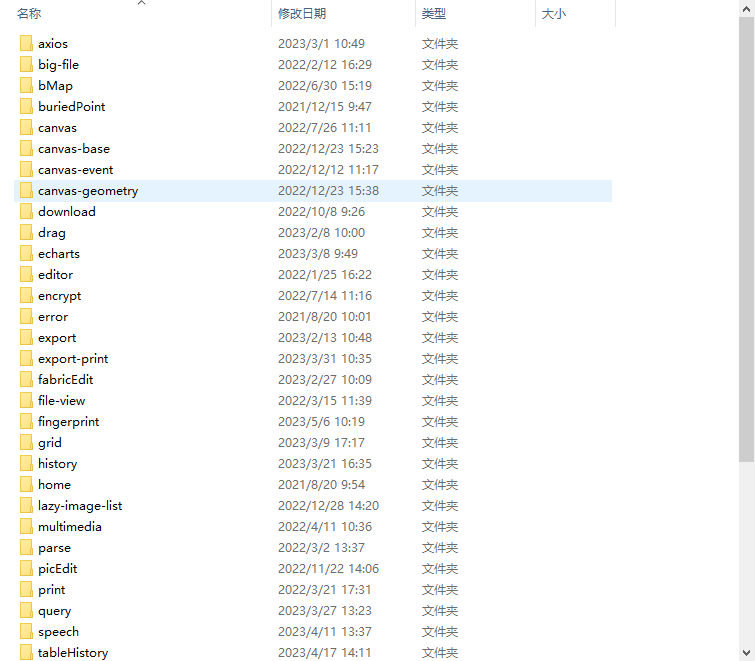

### 个人前端笔记 


[github](https://github.com/474366498/web-note.git)
[gitee](https://gitee.com/auqsse/web-note.git )

### 个人前端vue 
 

[github](https://github.com/474366498/vuePlugins.git)
[gitee](https://gitee.com/auqsse/vue-plugins.git)
> 因为写得比较随意 都是手动随机添加的 

### 个人前端react 

>具体内容 通过json-server做本地服务器 
```  json 

"data" : [
        {
            "menuname" :"基础plugin" ,
            "icon":"" ,
            "menuid":"base~plugin" ,
            "url":null ,
            "menus":[
                {
                    "menuname":"前端埋点" ,
                    "icon":"" , 
                    "menuid":"buriedPoint" ,
                    "menus":[] ,
                    "url":"buriedPoint"
                },
                {
                    "menuname":"webWorker" ,
                    "icon":"" , 
                    "menuid":"webWorker" ,
                    "menus":[] ,
                    "url":"webWorker"
                },
                {
                    "menuname":"countTo",
                    "icon":"",
                    "menuid":"countTo",
                    "menus":[] ,
                    "url":"countTo"
                },
                {
                    "menuname":"字符串加密" ,
                    "icon":"" , 
                    "menuid":"encrypt" ,
                    "menus":[] ,
                    "url":"encrypt"
                },
                {
                    "menuname":"自定义antd icon" ,
                    "icon":"" , 
                    "menuid":"userIcon" ,
                    "menus":[] ,
                    "url":"userIcon"
                },
                {
                    "menuname":"ctrl cv" ,
                    "icon":"" , 
                    "menuid":"ctrl" ,
                    "menus":[] ,
                    "url":"ctrlCV"
                },
                {
                    "menuname":"屏幕录制",
                    "icon":"",
                    "menuid":"record" ,
                    "url":"record"
                }
            ]
        },
        {
            "menuname":"文件类plugin" ,
            "icon":"" ,
            "menuid":"file-plugin" ,
            "url":null ,
            "menus":[
                {
                    "menuname":"上传(node)" ,
                    "icon":"" , 
                    "menuid":"upload" ,
                    "menus":[] ,
                    "url":"upload"
                },
                {
                    "menuname":"大文件(node)" ,
                    "icon":"" , 
                    "menuid":"bigFile" ,
                    "menus":[] ,
                    "url":"bigFile"
                },
                {
                    "menuname":"下载(node)" ,
                    "icon":"" , 
                    "menuid":"download" ,
                    "menus":[] ,
                    "url":"download"
                },
                {
                    "menuname":"文件预览" ,
                    "icon":"" , 
                    "menuid":"fileView" ,
                    "menus":[] ,
                    "url":"fileView"
                },
                {
                    "menuname":"打印" ,
                    "icon":"" , 
                    "menuid":"filePrint" ,
                    "menus":[] ,
                    "url":"filePrint"
                },
                {
                    "menuname":"图片编辑" ,
                    "icon":"" , 
                    "menuid":"imgEdit" ,
                    "menus":[] ,
                    "url":"imgEdit"
                },
                {
                    "menuname":"自动裁剪",
                    "icon":"",
                    "menuid":"autoCrop",
                    "menus":[] ,
                    "url":"autoCrop"
                },
                {
                    "menuname":"简单识别",
                    "icon":"",
                    "menuid":"discern",
                    "menus":[] ,
                    "url":"discern"
                }
            ]
        },

        {
            "menuname":"音视频plugin" ,
            "icon":"",
            "menuid":"multimedia~plugin",
            "url":null ,
            "menus":[
                {
                    "menuname":"音视频播放",
                    "icon":"" ,
                    "menuid":"multimedia",
                    "menus":[] ,
                    "url":"multimedia"
                },
                {
                    "menuname":"音乐播放器",
                    "icon":"",
                    "menuid":"useMusicPlayer" ,
                    "menus":[] ,
                    "url":"useMusicPlayer"
                },
                {
                    "menuname":"视频播放器",
                    "icon":"",
                    "menuid":"moviePlayer" ,
                    "menus":[] ,
                    "url":"moviePlayer"
                }
            ]
        },
        {
            "menuname":"富文本编辑器",
            "icon":"",
            "menuid":"editor",
            "url":"" ,
            "menus":[
                {
                    "menuname":"tinymceEditor" ,
                    "icon":"",
                    "menuid":"tinymceEditor",
                    "menus":[],
                    "url":"tinymceEditor"
                },
                {
                    "menuname":"wangEditor" ,
                    "icon":"",
                    "menuid":"wangEditor",
                    "menus":[],
                    "url":"wangEditor"
                },
                {
                    "menuname":"CKEditor" ,
                    "icon":"",
                    "menuid":"CKEditor",
                    "menus":[],
                    "url":"CKEditor"
                },
                {
                    "menuname":"Draft.js" ,
                    "icon":"",
                    "menuid":"Draft.js",
                    "menus":[],
                    "url":"DraftJs"
                },
                {
                    "menuname":"quill",
                    "icon":null ,
                    "menuid":"quill",
                    "menus":[],
                    "url":"quill"
                }
            ]
        },
        {
            "menuname":"地图plugin" ,
            "icon":"",
            "menuid":"map~plugin",
            "url":null ,
            "menus":[
                {
                    "menuname":"百度地图",
                    "icon":"" ,
                    "menuid":"bMap",
                    "menus":[] ,
                    "url":"bMap"
                },
                {
                    "menuname":"腾讯地图",
                    "icon":"" ,
                    "menuid":"tMap",
                    "menus":[] ,
                    "url":"tMap"
                },
                {
                    "menuname":"高德地图",
                    "icon":"" ,
                    "menuid":"gdMap",
                    "menus":[] ,
                    "url":"gdMap"
                }
            ]
        },
        {
            "menuname":"库",
            "icon":"" ,
            "menuid":"package",
            "url":"" ,
            "menus":[
               {
                "menuname":"virtual" ,
                "icon":"" ,
                "menuid":"" ,
                "url":"virtual"
               }
            ],
            "deem":"13款JavaScript图像处理库 https://blog.csdn.net/baidu_38493460/article/details/130760817 "
        },
        {
            "menuname":"其它",
            "icon":"",
            "menuid":"other",
            "url":"",
            "menus":[
                {
                    "menuname":"webRTC",
                    "icon":"",
                    "menuid":"webRTC",
                    "menus":[] ,
                    "url":"webRTC",
                    "demo" :"http://webrtc.p2hp.com/getting-started/overview.html#google_vignette , https://zhuanlan.zhihu.com/p/542466912"
                },
                {
                    "menuname":"webLive",
                    "icon":"",
                    "menuid":"webLive",
                    "menus":[] ,
                    "url":"webLive",
                    "demo" :"https://gitee.com/adonggege/live/blob/master/src/views/PushLive.vue "
                },
                {
                    "menuname":"可视化大屏",
                    "icon":"" ,
                    "menuid":"visualScreen",
                    "url":"visualScreen",
                    "demo":" https://baijiahao.baidu.com/s?id=1764791708311143877&wfr=spider&for=pc , http://datav.jiaminghi.com/ , https://github.com/DataV-Team/DataV , https://github.com/antvis/ "
                }
            ]
        }
    ]

```

[github](https://github.com/474366498/react-plugins.git)
[gitee](https://gitee.com/auqsse/react-run.git)


